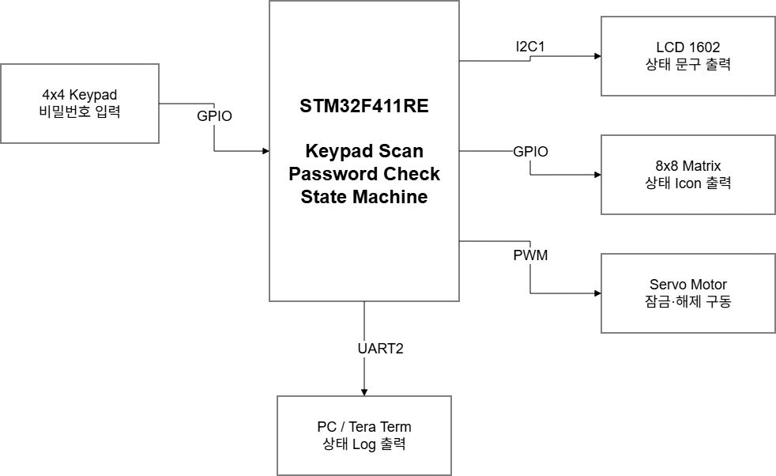
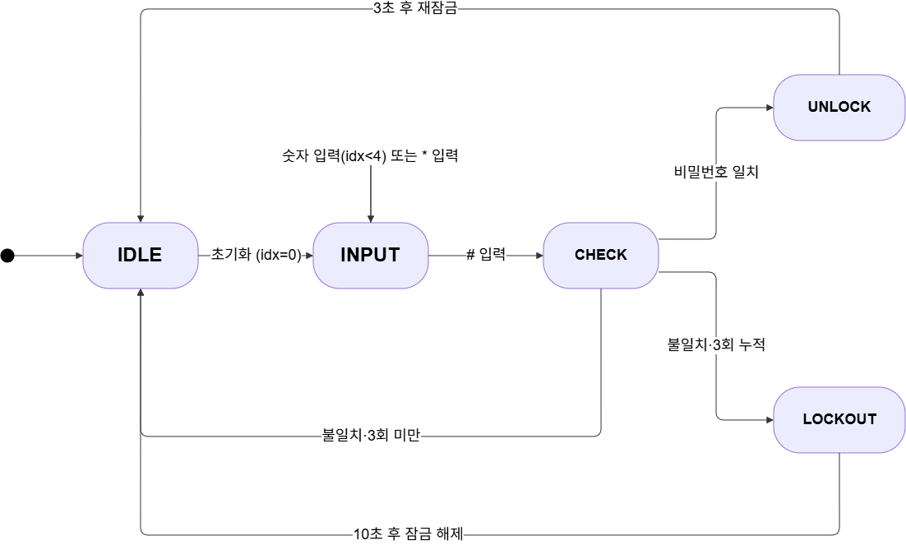
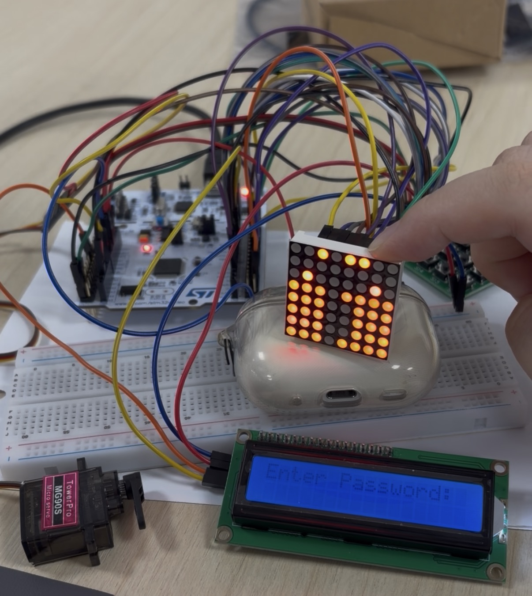
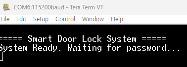
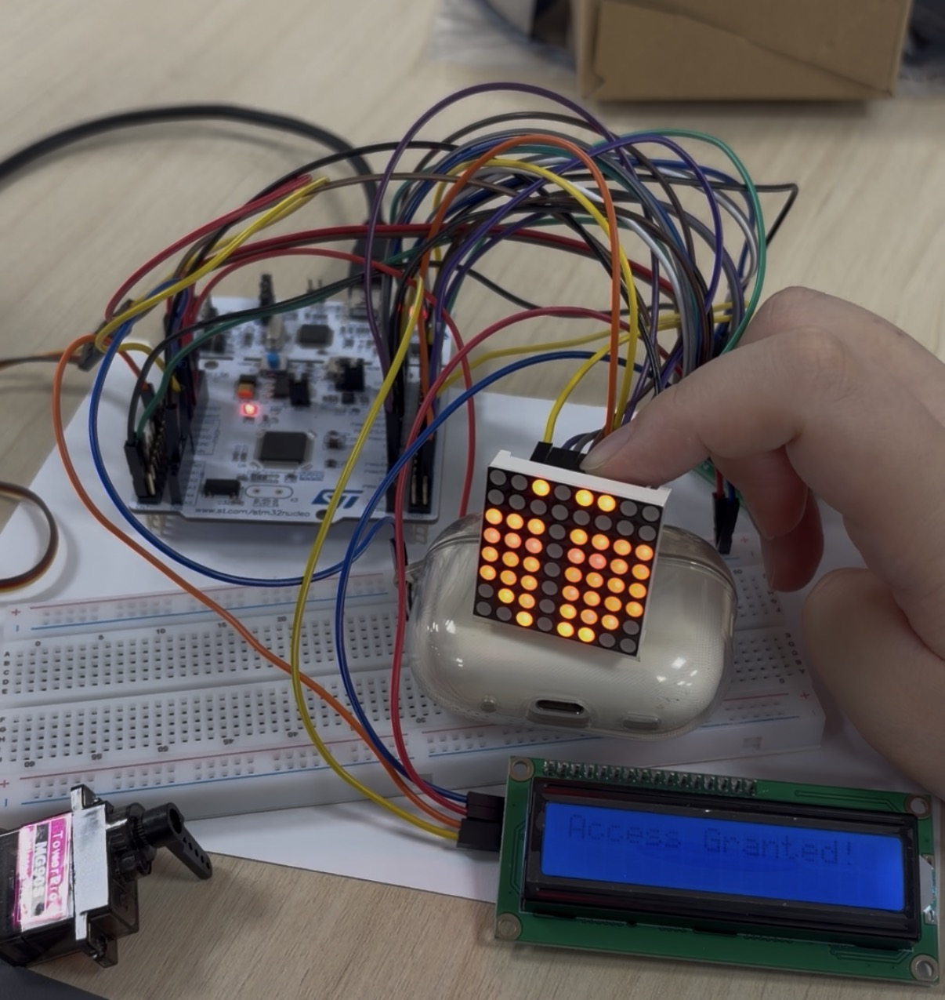
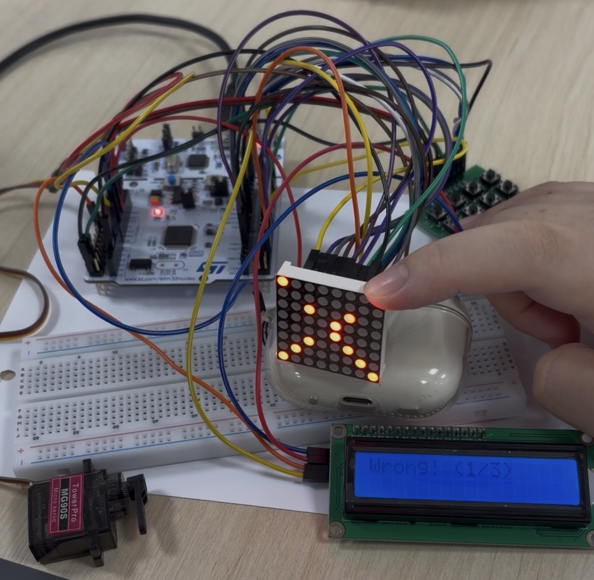
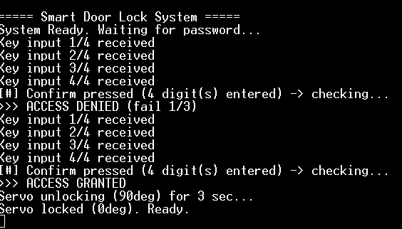
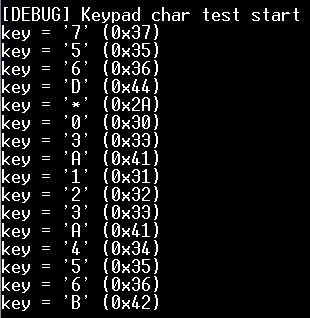

# 🔐 ARM Cortex-M4 Smart Door Lock System

STM32F411RE(ARM Cortex-M4, Nucleo-F411RE)를 **레지스터 직접 제어 방식(Bare-metal, HAL 미사용)**으로 구현한 비밀번호 인증형 도어락 시스템입니다. 4x4 키패드로 비밀번호를 입력받아 I2C LCD와 8x8 도트매트릭스로 인증 결과를 표시하고, 서보모터 PWM으로 잠금 개폐 동작을 모사합니다.

## 📌 Overview

| 항목 | 내용 |
|---|---|
| MCU | STM32F411RE (ARM Cortex-M4, 96MHz PLL) |
| 보드 | Nucleo-F411RE |
| 프로그래밍 방식 | 레지스터 직접 제어 (CMSIS 헤더 기반, HAL 미사용) |
| 툴체인 / 빌드 | arm-none-eabi-gcc / GNU Make |
| 디버깅·로그 | ST-LINK 가상 COM(UART2, 115200bps) + Tera Term |
| 입력 | 4x4 매트릭스 키패드 (GPIO 폴링 스캔) |
| 출력 | LCD1602(I2C, PCF8574T 0x27), 8x8 도트매트릭스(GPIO Mux), 서보모터(PWM) |
| 기본 비밀번호 | `1234` (3회 오답 시 10초 Lockout) |

## ✨ Features

- **비밀번호 인증 상태 머신**: IDLE → INPUT → CHECK → UNLOCK / 실패(최대 3회) → LOCKOUT
- **4x4 키패드 매트릭스 스캔**: Row 순차 구동 + Col 읽기, 1ms 디바운스 + 200ms 채터링 방지
- **I2C1 기반 LCD 제어**: PCF8574T 경유 HD44780 4비트 모드, START/ACK/STOP을 레지스터 레벨에서 직접 구현
- **서보모터 PWM 제어**: TIM2 Edge-aligned PWM(20ms 주기)로 0°↔90° 개폐 모사
- **8x8 도트매트릭스 멀티플렉싱**: 16개 GPIO로 64개 LED 제어, **TIM3 인터럽트(~1ms)** 기반으로 메인 루프의 블로킹 구간과 무관하게 안정적으로 화면 갱신
- **UART 상태 로그**: 실제 비밀번호 숫자는 로그에 남기지 않고 이벤트 단위로만 출력 (보안 고려)
- **타이머 자원 분리**: PWM(TIM2), 매트릭스 갱신(TIM3), Lockout 카운트(TIM4), 범용 딜레이(TIM5)를 서로 충돌 없이 독립 배치

## 🏗️ System Block Diagram



### 상태 머신



| 상태 | LCD 출력 | 매트릭스 아이콘 | 세부 동작 |
|---|---|---|---|
| IDLE / INPUT | `Enter Password:` | 자물쇠 | 키패드 폴링, 입력값 `*` 마스킹 (최대 4자리) |
| CHECK | - | - | 입력값과 저장된 비밀번호(`strcmp`) 비교 |
| UNLOCK | `Access Granted!` | 원(circle) | 서보 0°→90° 회전, 3초 대기 후 0° 복귀 |
| 실패(3회 미만) | `Wrong! (X/3)` | X | 1.5초 대기 후 IDLE 복귀 |
| LOCKOUT | `Locked. Wait...` | X | TIM4 인터럽트 기반 10초 카운트다운 후 복귀 |

### 타이머 자원 배분

| 타이머 | 용도 |
|---|---|
| TIM2 | 서보모터 PWM 생성 (TIM2_CH1, PA0) |
| TIM3 | 도트매트릭스 자동 갱신용 주기 인터럽트 (~1ms) |
| TIM4 | Lockout(잠금) 시간 카운트용 인터럽트 |
| TIM5 | 범용 블로킹 딜레이(`TIM2_Delay`) 전용 |

## 🔌 하드웨어 핀 배선

### 키패드 (매트릭스 스캔, 8선) — Row=Output(Push-Pull), Col=Input(Pull-up)

| 리본 순서 | 기능 | Nucleo 핀 |
|---|---|---|
| 1 | Col3 | PC9 |
| 2 | Col2 | PC8 |
| 3 | Col1 | PC7 |
| 4 | Col0 | PC6 |
| 5 | Row0 | PC2 |
| 6 | Row1 | PC3 |
| 7 | Row2 | PC10 |
| 8 | Row3 | PC11 |

> PC0/PC1은 Nucleo-F411RE에서 솔더 브릿지(SB51, SB56)로만 접근 가능해 일반 헤더에 노출되지 않아 PC2~PC11로 재배정했습니다. (자세한 경위는 Trouble Shooting 참고)

### LCD1602 (I2C1) / 서보모터 (PWM)

| 장치 | 핀 | Nucleo 핀 | 비고 |
|---|---|---|---|
| LCD | SDA | PB7 | I2C1_SDA (AF4) |
| LCD | SCL | PB6 | I2C1_SCL (AF4) |
| Servo | 신호(PWM) | PA0 | TIM2_CH1 |
| Servo | VCC | 외부 5V | Nucleo 내장 5V 사용 시 리셋 위험 (Trouble Shooting 참고) |

### 8x8 도트매트릭스 (1088BS) — Row=Anode(HIGH 활성화), Col=Cathode(LOW 점등)

| 다리 번호 | Nucleo 핀 | 다리 번호 | Nucleo 핀 |
|---|---|---|---|
| 1 | PB4 | 9 | PB0 |
| 2 | PC4 | 10 | PB11 |
| 3 | PB9 | 11 | PB13 |
| 4 | PB10 | 12 | PB3 |
| 5 | PC5 | 13 | PB8 |
| 6 | PB12 | 14 | PB1 |
| 7 | PB5 | 15 | PB14 |
| 8 | PB2 | 16 | PB15 |

> 2번/5번(Row7/Row8)은 원래 PB6/PB7 예정이었으나 LCD I2C1(SCL/SDA)과 충돌해 PC4/PC5로 재배정했습니다. 핀맵은 다리 1핀씩 순차 점등 후 실측으로 확정했습니다.

> Nucleo GND, LCD GND, 서보 GND(외부 전원 포함)는 모두 공통 그라운드로 연결해야 합니다.

## 📁 구성 파일

| 파일 | 설명 |
|---|---|
| `main.c` | 상태머신 및 전체 로직 |
| `keypad.c` | 4x4 키패드 매트릭스 스캔 |
| `lcd.c` | HD44780 LCD 문자 출력 제어 |
| `i2c.c` | I2C1 프로토콜(START/ACK/STOP) 레지스터 레벨 구현 |
| `servo.c` | TIM2 PWM 기반 서보모터 각도 제어 |
| `matrix.c` / `matrix.h` | 8x8 도트매트릭스 멀티플렉싱·아이콘, TIM3 인터럽트 |
| `timer.c` | 범용 딜레이(TIM5) 및 Lockout 타이머(TIM4) 인터럽트 |
| `clock.c` | 시스템 클럭(PLL, 96MHz) 초기화 |
| `uart.c` | UART2 송수신 및 printf 리다이렉션 |
| `device_driver.h` / `macro.h` / `option.h` | 드라이버 함수 선언, 매크로, 옵션 |
| `core_cm4.h` / `cmsis_*.h` | CMSIS 코어 헤더 |
| `exception.c` / `runtime.c` | 예외 벡터, 런타임 초기화 |

## 🖥️ UART 상태 로그 예시

```
===== Smart Door Lock System =====
System Ready. Waiting for password...
Key input 1/4 received
Key input 2/4 received
Key input 3/4 received
Key input 4/4 received
[#] Confirm pressed (4 digit(s) entered) -> checking...
>>> ACCESS DENIED (fail 1/3)
Key input 1/4 received
Key input 2/4 received
Key input 3/4 received
Key input 4/4 received
[#] Confirm pressed (4 digit(s) entered) -> checking...
>>> ACCESS GRANTED
Servo unlocking (90deg) for 3 sec...
Servo locked (0deg). Ready.
```

## 📸 동작 화면

| 초기 상태 (자물쇠 아이콘) | Tera Term 부팅 로그 |
|---|---|
|  |  |

| 인증 성공 (Access Granted) | 인증 실패 (Wrong) |
|---|---|
|  |  |

전체 시나리오 UART 로그:



## 🛠️ Trouble Shooting

| 문제 | 원인 | 해결 |
|---|---|---|
| 키패드 특정 Row가 항상 무응답 | Row를 PC0~PC3로 배정했으나, Nucleo-F411RE에서 PC0/PC1은 솔더 브릿지(SB51/SB56)로만 접근 가능해 일반 헤더에 미노출 (스키매틱 분석으로 확인) | 배선을 PC2~PC11로 재조정 |
| 같은 버튼을 눌러도 매번 다른 키 값 수신 | 원시 레지스터 값을 직접 출력하는 진단 펌웨어로 분석한 결과 노후된 점퍼 케이블의 접촉 불량 (소프트웨어 로직이 동일 조건에서 다른 결과를 낼 수 없다는 점에서 하드웨어 원인으로 결론) | 케이블을 신품으로 교체 |
| 도트매트릭스 특정 Column 미점등/중복 점등 | Row/Col 64개 조합을 전수조사하는 진단 펌웨어로, 모든 Row에서 동일 Column 인덱스가 반복 문제를 보이는 패턴 확인 → 특정 Column 배선의 접촉 불량/단선 | 문제 케이블(Col5, Col6) 재결선 |
| 서보 PWM 파형이 딜레이 호출마다 깨짐 | 서보 PWM(TIM2)과 범용 딜레이 함수가 동일한 TIM2 레지스터를 공유해 딜레이 호출 시마다 PWM 설정이 재초기화됨 | 딜레이 전용 타이머를 TIM5로 완전히 분리 |
| 서보모터가 전혀 동작하지 않음 | 서보 VCC를 브레드보드 3.3V 레일에 연결 — SG90급 서보의 정격 동작 전압(4.8V 이상) 미달 | 외부 5V 전원 사용이 정식 해결책이나, 실습 환경 제약으로 Nucleo 5V 핀을 임시 사용 (전류 소비로 인한 시스템 불안정 가능성 있어 향후 독립 5V 전원 권장) |

키패드 진단 펌웨어 출력 예시:



## 🗺️ 향후 개선 방향

- 비밀번호를 STM32 내장 Flash에 저장해 전원 재인가 후에도 유지
- 관리자 모드 추가로 런타임 비밀번호 변경 지원
- 피에조 부저 추가로 키 입력/인증 성공-실패/Lockout 진입 시 청각 피드백
- PIR/초음파 센서로 사용자 접근 감지 및 자동 화면 활성화
- 다중 사용자 비밀번호 지원 및 UART 로그 기반 출입 이력 관리

## ⚙️ Build & Run

1. 프로젝트 루트에서 `make`로 빌드 (`rom_0x08000000.elf/.bin/.map` 생성 확인)
2. STM32CubeProgrammer 등으로 `rom_0x08000000.elf`를 Nucleo 보드에 플래싱
3. 리셋 후 LCD에 `Enter Password:`, 매트릭스에 자물쇠 아이콘 표시되면 정상 초기화
4. 키패드로 `1234` 입력 후 `#`으로 정상 동작 확인 (기본 비밀번호: `1234`)

## 🎓 결론

STM32의 GPIO, I2C, PWM, 타이머 인터럽트를 레지스터 레벨에서 직접 제어하는 방법을 실습했고, 하드웨어 디버깅 과정에서 소프트웨어 로직과 물리적 배선 문제를 구분해 원인을 좁혀나가는 진단 방법론(원시 데이터 출력을 통한 실측 기반 검증)을 적용했습니다. 데이터시트상의 공식 정보만으로는 실제 하드웨어와 일치하지 않을 수 있으며, 이런 경우 자체 진단 펌웨어로 실측하는 것이 가장 신뢰도 높은 문제 해결 방법임을 확인했습니다.
